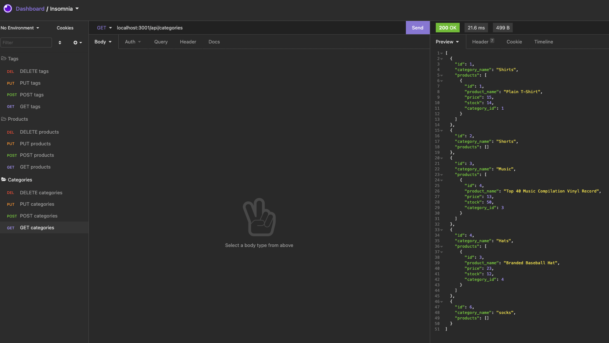

# E-CommerceBackEnd
    
## Description 
This application is a back end for an e-commerce website that allows the user to insert products.

## Table of Contents
- [Installation](#installation)
- [Usage](#usage)
- [Contribution](#contribution)
- [Tests](#tests)
- [License](#license)
- [Contact Me](#contact-me)
- [Videos](#video)

## Installation
1) Clone repository to visual studio code
2) Run npm install
3) Create database in mysql using the schema.sql folder
4) Create .env folder and data it needs
5) Run node node seeds/index.js to seed the database
6) Run node server.js to start the server

## Usage
Use insomnia to run requests

## Contribution
Zion Flores

## License
MIT

## Contact Me
GitHub: https://github.com/Zi-on

Email: Zioniflores12@yahoo.com

## Video
https://www.youtube.com/watch?v=Zou6Fy-51Uc